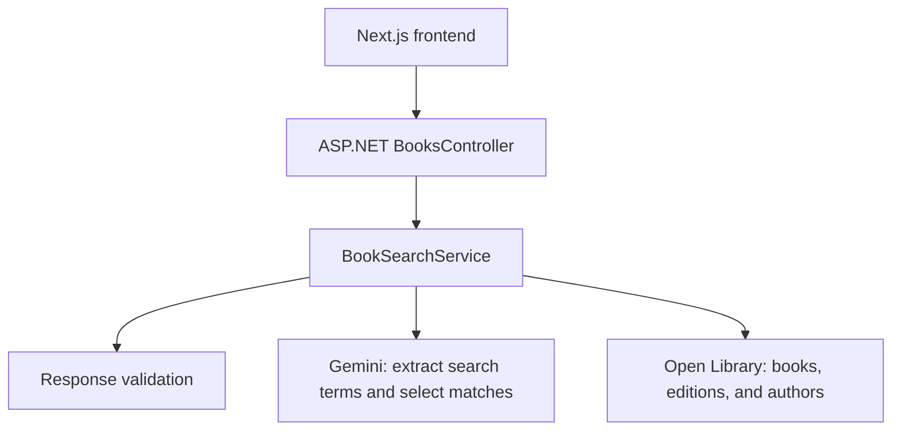

# FindBook

FindBook uses Gemini and Open Library to find books from a title, author, or description. Gemini understands the request and selects relevant matches; Open Library supplies the book details.

## Design



## Run locally

1. [Get a free Gemini API key in Google AI Studio](https://aistudio.google.com/apikey): sign in with your Google account, click **Create API key**, and copy the key. Free-tier usage limits apply.
2. Create a `.env` file in the project root (next to `compose.yaml`):

   ```env
   GEMINI_API_KEY=your-key-here
   ```

3. Make sure Docker is installed and running.
4. From the project root, run:

   ```sh
   docker compose up --build
   ```

Open [localhost:3000](http://localhost:3000).
