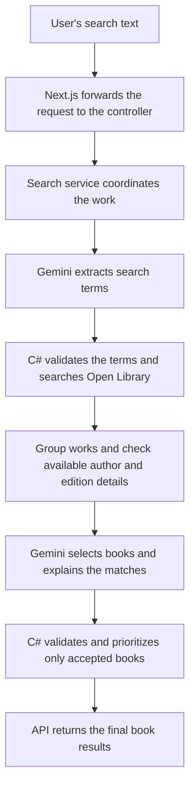

# FindBook

FindBook finds books from a title, author, or a few details you remember. It uses a Next.js frontend, a .NET 8 API, Gemini, and Open Library.

## Setup and running

You need Docker with Docker Compose, an internet connection, and a [Gemini API key](https://aistudio.google.com/apikey). Docker builds both applications; you do not need to install .NET or Node.js to run them this way.

1. Clone the repository:

   ```sh
   git clone https://github.com/Taha7865/FindBook.git
   cd FindBook
   ```

2. Create a `.env` file in the project root, next to `compose.yaml`:

   ```env
   GEMINI_API_KEY=your-key-here
   ```

3. Start Docker, then run:

   ```sh
   docker compose up --build
   ```

Open [localhost:3000](http://localhost:3000). The API runs at [localhost:8080](http://localhost:8080/api/health). To stop both services, run `docker compose down`.

The default model is `gemini-3.5-flash-lite`. Set `GEMINI_MODEL` in `.env` to override it. The key stays on the server; `.env` is ignored by Git. Each person running the app supplies their own key. Provider quotas still apply, including when retries are enabled.

If search reports that it is not configured, check `GEMINI_API_KEY` and run `docker compose up -d` again. Host .NET user secrets are not passed into Docker. Use `docker compose logs -f api` to inspect API logs. The health endpoint confirms the API is running; it does not check Gemini credentials or provider availability.

Test the API directly:

```sh
curl -i http://localhost:8080/api/books/search \
  -H 'Content-Type: application/json' \
  -d '{"query":"tolkien hobbit illustrated deluxe 1937"}'
```

For development without Docker, install the .NET SDK specified in [global.json](global.json) and Node.js 24. From the project root, configure the key and start the API:

```sh
dotnet user-secrets set 'GeminiApi:ApiKey' 'your-key-here' --project app/Api
dotnet run --project app/Api
```

In another terminal:

```sh
cd app/frontend
npm ci
npm run dev
```

The frontend forwards requests to `http://127.0.0.1:8080` by default. Set `API_BASE_URL` in its server environment if the API runs elsewhere.

## Implementation overview

A search is one browser request. The backend normally makes two Gemini calls, with Open Library requests between them:

1. Gemini extracts a possible title, author, keywords, publication year, and edition clues from the text.
2. C# validates those fields and searches Open Library for up to 20 candidates. It groups records by work ID and fetches author or edition details where needed.
3. Gemini receives the original query and fetched candidates. It selects up to five relevant books and writes a short explanation for each. It can reject every candidate.
4. C# validates the selection, applies a small set of exact-match and popularity preferences, and returns the results.



This shows the normal successful path. Empty results can trigger the limited fallbacks described below. Gemini does not control those calls; the search service does.

| Location | Responsibility |
| --- | --- |
| `app/Api` | Controllers, search service, dependency injection, and `appsettings.json`. |
| `app/Domain` | Client interfaces and implementations, models, prompts, options, and validation. |
| `app/frontend` | Search page, result cards, and the server route that forwards requests to the API. |
| `app/Tests` | Service, HTTP client, validation, and API integration tests. |

Controllers handle HTTP requests and errors. The service coordinates the search. Clients handle provider requests and response mapping. Client interfaces and the validator are injected so tests can replace them. The service is concrete because it has one implementation. `Domain` includes the external clients; it is not a separate, infrastructure-free domain layer.

## Features implemented

- Search by title, author, topic, partial names, or noisy text. Gemini interprets spelling mistakes and remembered clues.
- Return one clear match or up to five ordered possibilities, with short explanations tied to fetched book details.
- Show covers, author names, a primary-author label when established, first publication year, and Open Library links.
- Group editions under their work and use requested years or edition features when searching. Show available edition dates and details separately.
- Submit with Enter or the search button; use Shift + Enter for a new line. Support cancellation, loading, empty results, and error messages.
- Reject empty or oversized input. Return structured errors for invalid requests, unavailable providers, timeouts, and invalid provider output.

## Assumptions and design decisions

### Requirement priorities

I prioritized the complete search flow, then reliable selection boundaries and failure handling. Specific searches should identify the intended book, author-only searches should offer up to five relevant works, and editions should stay grouped. Gemini handles language interpretation; C# enforces rules that can be checked against catalog data. I focused testing on those boundaries and on provider failures. Caching, broader search expansion, and automated browser tests were deferred to keep the assessment scope manageable.

### Gemini and the C# helper have different jobs

Gemini handles interpretation, near matches, subtitle variants, relevance, and explanations. The selection prompt asks it to prefer exact title and work-author matches, then contributor matches, near matches, and relevant author alternatives. These are model instructions, not a mathematical scoring guarantee.

This keeps language interpretation out of a large C# matcher full of special cases. The tradeoff is that model results can vary, take longer, and occasionally be wrong. Explicit calls keep the sequence and request limits visible in the service; Gemini does not call Open Library tools itself.

The C# helper only operates on books Gemini accepted. It normalizes case, punctuation, and accents, then checks the original query against full titles and fetched work-author names or aliases. It prefers those exact matches and can reduce exact-title alternatives to one when a single positive reading-list count leads. Author-only results are ordered by that count. It makes no API calls and does not interpret plot clues, calculate a confidence score, or restore a rejected book.

Gemini rejecting all candidates is a valid empty selection. Invalid JSON or invented work IDs are errors, not empty searches. A successful search with no matches returns `200` with `matches: []`; empty input returns `400`.

### Catalog records determine what can be returned

Open Library supplies the book facts. Gemini can suggest search terms, but it must select IDs from the fetched candidates. The validator enforces that boundary and rejects duplicate selections. Prompts ask for natural explanations grounded in the supplied fields; validation does not prove that every sentence is factually supported.

A **work** is the overall book; an **edition** is a particular published version. Grouping uses Open Library's work ID, so separate catalog IDs for the same real book are not automatically merged. A work's first publication year is not used as an edition's publication date.

`GroupWorks` combines records with the same work ID. `ReadEditionAsync` fetches one edition and checks its parent work and requested year; it does not group books. General "published in" requests use the work's `first_publish_year`, while explicit edition or reprint years use `publish_year` and edition details.

`authors[]` remains available. `primaryAuthor` is set only when the work links one author, or uniquely marks an author with the role `primary author`, and all linked author lookups succeed. Otherwise it is `null`. This is an application rule based on catalog evidence, not a dedicated Open Library primary-author field. The UI uses this value for its label.

### Searches and detail lookups are bounded

When no title is extracted, the client requests Open Library's `sort=readinglog`. Its `readinglog_count` measures reading-list activity, which serves as a popularity signal rather than a sales ranking. Reported counts rank above missing counts; popularity does not override a stronger exact match in the helper. Author-only searches return up to five accepted works, not necessarily five if fewer are relevant.

Keyword-only searches omit nested edition fields because requesting them can exclude works that matched through subjects. Title, author, and edition requests retain those fields.

If an edition search finds nothing, the service retries without edition restrictions. If a title-and-author search finds nothing, or Gemini rejects its candidates, it can try that author's works once. There is no general multiple-query expansion for description searches. Extra fallback rounds can add catalog requests and a further Gemini selection call.

Author verification checks up to five candidate works per round and shares a limit of ten author lookups across the request. Edition detail requests are limited to five per catalog search. These limits control waiting time and request volume; unchecked details stay unknown. An obscure plot clue can still miss the intended book if Open Library never returns it.

### Configuration, reliability, and secrets

Non-secret settings live in `app/Api/appsettings.json` and bind to client options. `IHttpClientFactory` creates the configured clients. A shared .NET resilience handler retries transient failures for both providers: two retries, exponential delays with jitter, and support for `Retry-After`. Client timeouts also cover retry delays. Retrying a Gemini request can use additional quota.

The browser talks to a Next.js server route, which forwards to the API. Only the API uses the Gemini key. `Safeguard.cs` separates system instructions from user and catalog data; structured output and validation add checks. This is a basic prompt-injection precaution, not a complete defense. The app needs no database or user account.

There is no persistent cache, vector search system, or AI tool-calling framework. Each search fetches fresh provider results, although author lookups are reused within that request. This keeps the application small but makes response time and availability depend on external services.

## Testing strategy

Tests use xUnit and simulated provider responses, so they are repeatable and require no real API key or credits.

- **Service tests** inject client and validator interfaces. They cover grouping, accepted-only ranking, popularity, fallbacks, primary authors, lookup limits, and cancellation.
- **API integration tests** use `WebApplicationFactory` and replace external HTTP transports. Routing, request validation, clients, retry handling, and response serialization run together.
- **Client and validator tests** check structured model output, credentials staying out of URLs and prompts, author and edition mapping, invalid selections, provider errors, and shared retries.

From the project root, with the .NET SDK installed:

```sh
dotnet test FindBook.sln
```

For frontend type and production-build checks:

```sh
cd app/frontend
npm ci
npm run typecheck
npm run build
```

Manual checks cover search results, loading, cancellation, empty states, errors, and responsive layout. Live queries such as `The Hobbit`, `J.K. Rolling`, and `a book about a dragon` help assess model behavior. Mocked tests verify application rules; they cannot establish real search accuracy or guarantee grounded explanations. Automated browser tests and CI are not included yet.

## Future improvements

- Build a repeatable set of title, author, noisy, and plot-clue queries. Measure candidate retrieval separately from Gemini's selection and explanations before changing prompts or adding broader searches.
- Fetch useful book descriptions where available to support richer explanations. Check unsupported claims and primary-author ambiguity across more real records.
- Cache repeated catalog requests and measure latency, provider failures, and request counts before increasing lookup limits.
- Add automated browser tests for the main user flows and run backend tests, frontend checks, and Docker builds in CI.
- For a hosted demo, add request limits and managed secrets so reviewers can try the app without supplying their own key.
